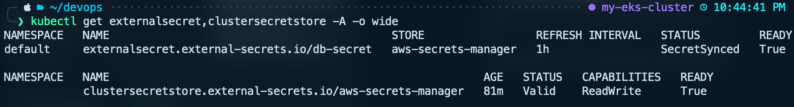
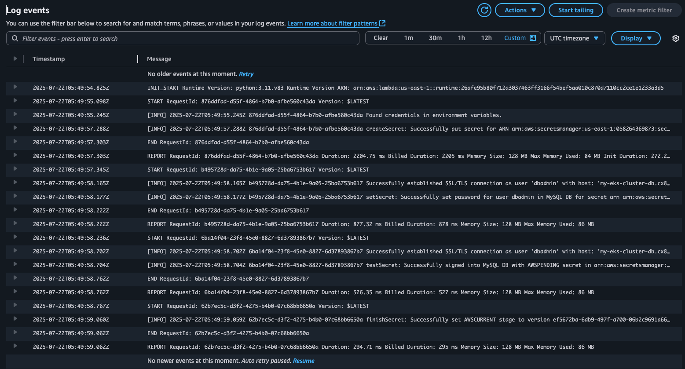
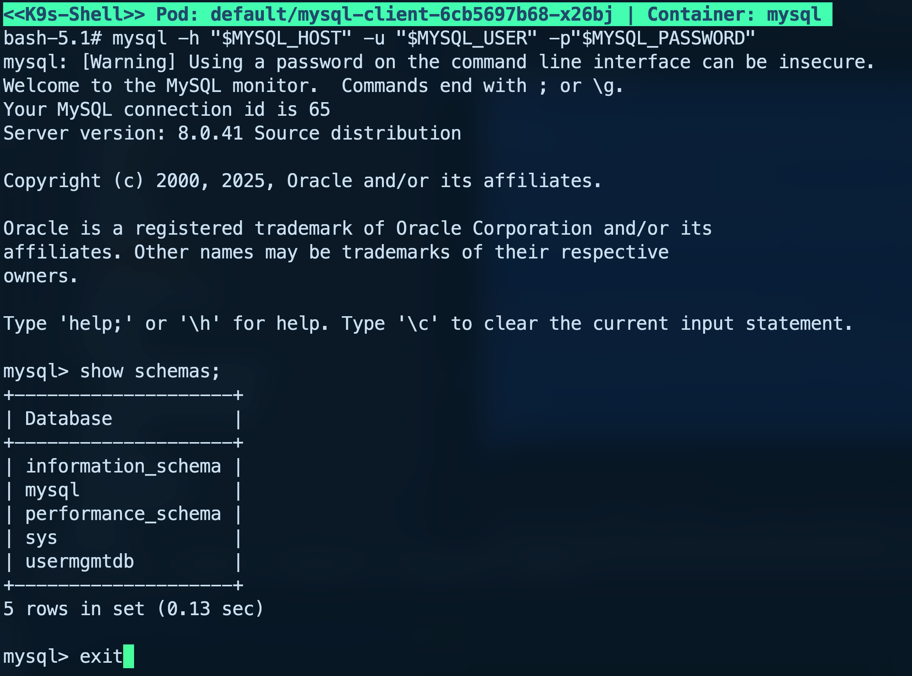

# Terraform Setup for EKS + Secrets Manager + ESO

A minimal and extensible infrastructure template that demonstrates how to inject and rotate secrets from AWS Secrets Manager into Kubernetes using External Secrets Operator (ESO), fully provisioned with Terraform.

This repository provisions an EKS cluster, sets up IAM roles via IRSA, and deploys an RDS MySQL database with automated password rotation using AWS Lambda. It integrates ESO to expose secrets from AWS Secrets Manager to Kubernetes workloads securely. The setup also includes test deployments for validation.

Helm values and Kubernetes manifests are rendered using `gomplate` based on Terraform outputs, enabling a clean GitOps-friendly deployment workflow.

The goal is to keep the setup simple, reproducible, and aligned with how External Secrets Operator and AWS Secrets Manager are typically used in production environments.

### ✦ Features

* Complete EKS and VPC provisioning via Terraform
* RDS MySQL instance with random password generation and AWS-managed rotation
* Lambda function for automatic password rotation via Secrets Manager
* External Secrets Operator installed and configured with IRSA permissions
* gomplate-powered rendering of Helm values and Kubernetes manifests
* Sample workloads that consume secrets and validate integration (e.g. MySQL client, log printer)

---

## 📁 Repository Structure

```
.
├── 01-infra                # Terraform code for core AWS infrastructure
│   ├── main.tf
│   ├── outputs.tf
│   ├── providers.tf
│   ├── variables.tf
│   └── modules/            # Reusable Terraform modules
│       ├── 01-vpc/         # VPC with public/private subnets (same as Karpenter template)
│       ├── 02-eks/         # EKS cluster and node group (same as Karpenter template)
│       ├── 03-rds/         # RDS MySQL instance, password secret, Lambda rotation
│       └── 04-irsa/        # IRSA role with policy for ESO access to Secrets Manager
├── 02-render               # gomplate rendering engine
│   ├── render.sh           # Script to render manifests from Terraform outputs
│   └── templates/          # gomplate templates for ESO Helm values
├── 03-install              # Output manifests and Helm values
│   ├── helm-values/        # Rendered Helm values for installation
│   └── manifests/          # ClusterSecretStore, ExternalSecret, tests
├── docs/
│   └── screenshots/        # Optional screenshots
```

---

## ✦ Prerequisites

The following tools must be available in your environment:

* **Terraform** — for provisioning AWS infrastructure
* **AWS CLI** — used by Terraform and general access to AWS
* **kubectl** — to apply Kubernetes manifests and interact with the cluster
* **gomplate** — for rendering manifests and Helm values from templates
* **Helm** — to install Karpenter into the cluster

---

## ⚙️ Setup Instructions

### 1. Provision Infrastructure

#### terraform.tfvars

You don't need to create a `terraform.tfvars` file unless you want to override the default configuration. All variables have safe and low-cost defaults, but for customization (such as region, AZs, or instance types), an example file `terraform.tfvars.example` is provided.

💡 The defaults are optimized for learning, demos, and minimal AWS costs.

This step provisions all core AWS resources: VPC, subnets, Internet Gateway, IAM roles, RDS MySQL database, AWS Lambda and the EKS cluster itself.

```bash
cd 01-infra
terraform init
terraform apply
```

Once complete, Terraform will produce a set of outputs that will be consumed by the next step.

Among the outputs, you will see a ready-to-run command for configuring your kubeconfig to access the cluster:

**aws eks update-kubeconfig --region <\*\*\*\*> --name <\<cluster\_name>>**

This command is generated automatically based on your configuration.

---

### 2. Render Manifests

This step takes the Terraform outputs and uses them to generate Helm values using gomplate.

```bash
cd ../02-render
bash render.sh
```

The rendered files will be placed into `03-install/helm-values`.

---

### 3. Install ESO and Kubernetes Resources

```bash
cd ../03-install

# Install ESO Helm chart
helm upgrade --install external-secrets external-secrets/external-secrets \
  -n external-secrets --create-namespace \
  -f 03-install/helm-values/external-secrets-values.yaml

# Apply core manifests
kubectl apply -f 03-install/manifests/
```

This step installs the External Secrets Operator into the cluster and applies Kubernetes manifests that define:

* A `ClusterSecretStore` linked to AWS Secrets Manager
* An `ExternalSecret` that syncs data from a specific AWS secret into a Kubernetes secret
* A test pod that logs the secret values
* A MySQL client deployment that connects to the RDS instance using credentials stored in Secrets Manager

---

## ✦ Verify Secrets Integration

Once everything is deployed, you can validate that secrets are being successfully synced from AWS Secrets Manager to your Kubernetes workloads.

1. **Inspect Kubernetes Secret**

You can directly list and describe the synced Kubernetes secret created by External Secrets Operator. This is the simplest way to confirm that the secret exists and contains the expected data:

```bash
kubectl get secret rds-secret -o yaml
```

2. **View synced secret values via logs**

A test deployment is configured to consume the injected secret and print the values to the logs. This is a quick way to verify that External Secrets Operator is working correctly:

```bash
kubectl logs deploy/test-deployment
```

3. **Connect to the RDS database using secrets**

A MySQL client pod is also deployed to test live access to the RDS instance. You can open a shell session inside the pod and run the `mysql` command using the synced secrets as credentials:

```bash
kubectl exec -it deploy/mysql-deployment -- /bin/sh
```

Once inside the pod:

```bash
mysql -h "$MYSQL_HOST" -u "$MYSQL_USER" -p"$MYSQL_PASSWORD"
```

4. **Trigger manual secret rotation via AWS Console**

You can test the rotation flow by manually triggering it:

* Open the **AWS Console** → **Secrets Manager**
* Locate the RDS secret created by the Terraform module
* Choose **Rotate secret immediately** from the Actions menu

This triggers the Lambda function that updates the RDS password. You can then:

* Inspect the logs of the rotation Lambda function via **CloudWatch Logs**
* Wait a few moments, then re-check the synced secret in Kubernetes

---

## ✦ Secret Lifecycle in Action

<details>
<summary>▶️ Synced ESO Resources in Cluster</summary>



</details>

<details>
<summary>▶️ Lambda Rotation Logs in CloudWatch</summary>



</details>

<details>
<summary>▶️ MySQL Client Connected with Rotated Secret</summary>



</details>

---

## ✦ Cleanup Notes

To delete all provisioned resources, simply destroy the infrastructure with Terraform.

```bash
cd 01-infra
terraform destroy
```

This command will:

* Remove the EKS cluster and all associated node groups
* Delete the RDS instance and related secrets
* Clean up IAM roles, VPC, subnets, and Lambda resources

---

## 📄 License

MIT © [Serhii Myronets](https://github.com/your-github-profile)
